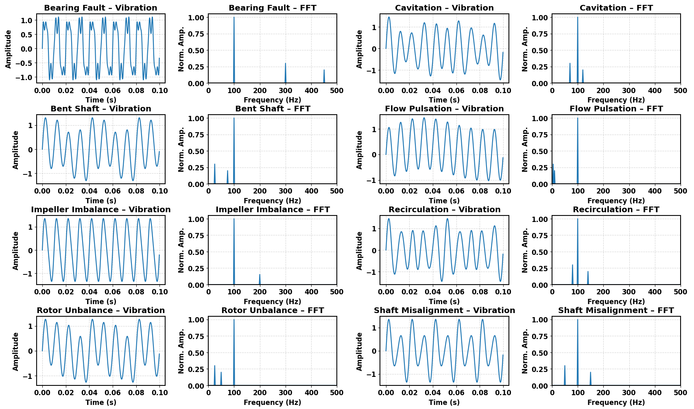
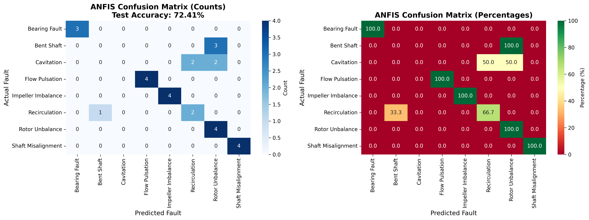
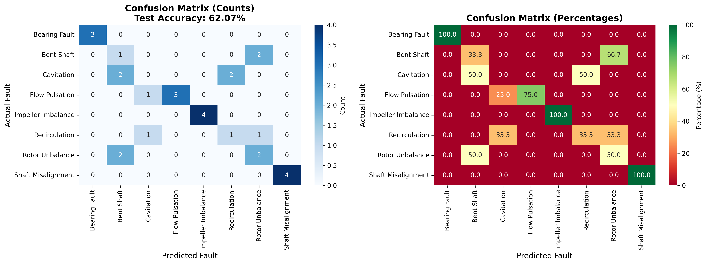

<div align="center">

# 🔧 Pump Fault Simulation & Comparative Analysis

### Synthetic Pump Fault Classification: ANN vs ANFIS vs Fuzzy Logic

[](https://www.python.org/)
[](https://numpy.org/)
[](https://pandas.pydata.org/)
[](https://scikit-learn.org/)
[](https://matplotlib.org/)
[](LICENSE)

**A physics-based synthetic pump fault dataset covering 8 real-world fault types, paired with a comparative study of three intelligent classification models — ANN, ANFIS, and Fuzzy Logic — for predictive maintenance applications.**

>  This research was carried out in collaboration with **CSIR-CSIO, Chennai** — one of India's premier research institutions in instrumentation and industrial technology.

[Dataset](#-dataset) · [Fault Types](#-fault-types) · [Model Results](#-model-benchmark-results) · [Installation](#-installation) · [Usage](#-usage) · [Roadmap](#-roadmap)

</div>

---

## 📌 Overview

Real-world pump failure data is expensive, difficult to collect, and rarely labeled. This project addresses that gap by **synthetically generating 8 pump fault types using physics-based mathematical formulas in Python**, producing vibration signal data that closely mimics real industrial pump behavior.

Three intelligent classification models were then benchmarked against this dataset:

- **ANN** — Artificial Neural Network
- **ANFIS** — Adaptive Neuro-Fuzzy Inference System
- **Fuzzy Logic** — Rule-based fuzzy classifier

The results provide clear guidance on which model is best suited for real-world predictive maintenance deployments.

---

## ⚙️ Fault Types

The dataset covers **8 synthetic pump fault types**, each generated using dedicated physics-based formulas:

| # | Fault Type | Description |
|---|---|---|
| 1 | ⚙️ **Bearing Fault** | Simulates defect frequencies in rolling element bearings |
| 2 | 🔩 **Bent Shaft** | Models vibration due to shaft deformation |
| 3 | 💧 **Cavitation** | Replicates pressure fluctuations from vapour bubble collapse |
| 4 | 🌊 **Flow Pulsation** | Captures periodic flow irregularities in the pump |
| 5 | ⚖️ **Impeller Imbalance** | Simulates asymmetric mass distribution in the impeller |
| 6 | 🔄 **Recirculation** | Models reverse flow patterns at suction or discharge |
| 7 | 🌀 **Rotor Unbalance** | Represents centrifugal force imbalance in the rotating assembly |
| 8 | 📐 **Shaft Misalignment** | Simulates angular or parallel misalignment between coupled shafts |

---

## 📁 Dataset

Each fault type is stored as a **separate CSV file**, making it easy to load individual faults or combine them for multi-class classification.

```
dataset/
├── bearing_fault.csv
├── bent_shaft.csv
├── cavitation.csv
├── flow_pulsation.csv
├── impeller_imbalance.csv
├── recirculation.csv
├── rotor_unbalance.csv
└── shaft_misalignment.csv
```

**Dataset Features:**

| Column | Description |
|---|---|
| `vibration` | Vibration signal amplitude (generated via formula) |
| `fault_label` | Fault type label (string) |
| `fault_id` | Encoded fault class (integer) |

Each CSV contains synthetic time-series vibration data sampled at consistent intervals, with clearly labeled fault classes — ready for direct use in ML pipelines.

---

## 🏆 Model Benchmark Results

Three classifiers were trained and evaluated on the synthetic dataset. Results are based on classification accuracy:

| Model | Accuracy | Notes |
|---|---|---|
| 🥇 **ANN** | **90.79%** ✅ | Best overall performance |
| 🥈 **ANFIS** | **72.41%** ⚠️ | Moderate accuracy, high interpretability |
| 🥉 **Fuzzy Logic** | **62.07%** ❌ | Rule-based, limited scalability |

Among the three models tested, ANN led with 91% accuracy, followed by ANFIS at 72.41%, while Fuzzy Logic trailed at 62.07% — a nearly 29% gap between the best and worst performer.

**Key Takeaway:** ANN proved far superior in raw predictive accuracy for pump fault classification. While ANFIS and Fuzzy Logic offer interpretability advantages in industrial settings, ANN is the recommended model for deployment in real-world predictive maintenance pipelines.

---


---

## 📊 Visualizations

<div align="center">

| | |
|:---:|:---:|
|  |  |
|  |  |

</div>

---

## ⚙️ Installation

### Prerequisites

- Python 3.11+
- pip

### Step 1 — Clone the Repository

```bash
git clone https://github.com/yourusername/pump-fault-simulation.git
cd pump-fault-simulation
```

### Step 2 — Install Dependencies

```bash
pip install -r requirements.txt
```

**requirements.txt:**
```
numpy
pandas
scikit-learn
matplotlib
seaborn
```

---

## 🚀 Usage

### Generate the Dataset

Run any individual fault generator:

```bash
python generation/bearing_fault.py
```

Or generate all 8 faults at once:

```bash
for f in generation/*.py; do python "$f"; done
```

### Train & Evaluate Models

```bash
# Run ANN classifier
python models/ann_classifier.py

# Run ANFIS classifier
python models/anfis_classifier.py

# Run Fuzzy Logic classifier
python models/fuzzy_classifier.py
```

### Run Comparative Analysis

```bash
python analysis/comparative_analysis.py
```

This will output accuracy scores for all three models and generate benchmark plots.

### Generate Confusion Matrix

```bash
python analysis/confusion_matrix.py
```

---

## 🔬 Methodology

```
Physics-Based Formulas (Python)
          │
          ▼
  Vibration Signal Generation
  (8 fault types × N samples)
          │
          ▼
     CSV Dataset Files
          │
          ▼
  Feature Extraction & Preprocessing
  (FFT-based features, normalization)
          │
     ┌────┴────┐
     │         │
     ▼         ▼
  Train      Test
  Split      Split
     │         │
     ▼         ▼
┌─────────┐ ┌─────────┐ ┌─────────────┐
│   ANN   │ │  ANFIS  │ │ Fuzzy Logic │
│  91.00% │ │  72.41% │ │   62.07%    │
└─────────┘ └─────────┘ └─────────────┘
          │
          ▼
  Comparative Analysis Report
  + Confusion Matrix Heatmaps
```

---

## 🗺️ Roadmap

- [ ] Add FFT and statistical features (RMS, kurtosis, skewness)
- [ ] Include additional models: SVM, Random Forest, XGBoost
- [ ] Add deep learning comparison: CNN, LSTM for time-series
- [ ] Build an interactive dashboard for real-time fault visualization
- [ ] Add noise injection to simulate real sensor data
- [ ] Docker support for one-command setup
- [ ] Publish dataset on Kaggle

---

## 🤝 Collaboration

This project was carried out in collaboration with **CSIR-CSIO, Chennai (Central Scientific Instruments Organisation)** — a constituent laboratory of the Council of Scientific & Industrial Research (CSIR), Government of India, specializing in instrumentation, sensors, and industrial technology research.

---

## 📄 License

This project is licensed under the **MIT License** — see the [LICENSE](LICENSE) file for details.

---

<div align="center">

Built with ❤️ using Python · NumPy · Pandas · Scikit-learn · Matplotlib  
In collaboration with **CSIR-CSIO, Chennai**

**Star ⭐ this repo if you found it useful!**

</div>
